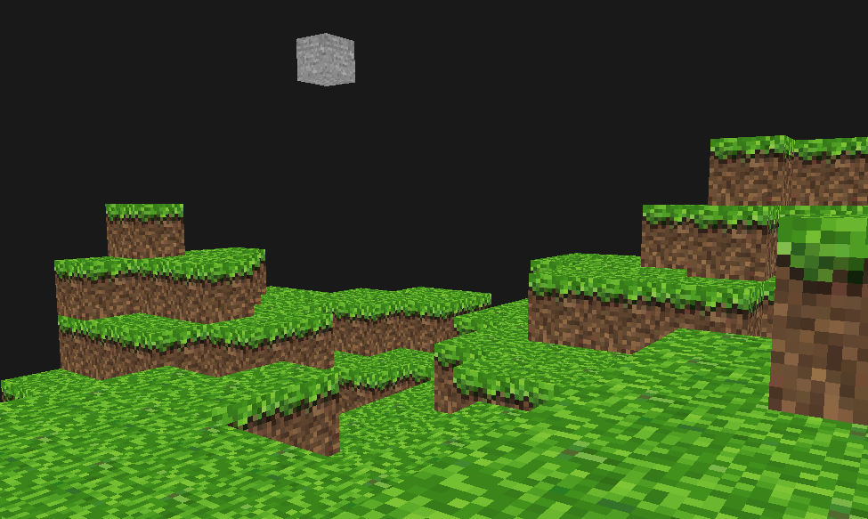

# BlockEngine
Simple minecraft clone. Randomly generates a single 16 x 16 chunk which you can walk on. 

# Todo.
- Better collision detection.
- Varied blocks.
- Removing blocks.
- multiple chunks.
- biomes.

